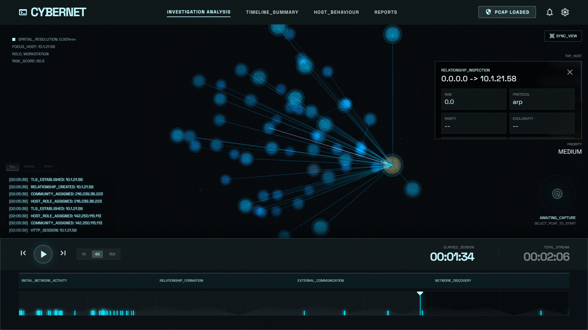
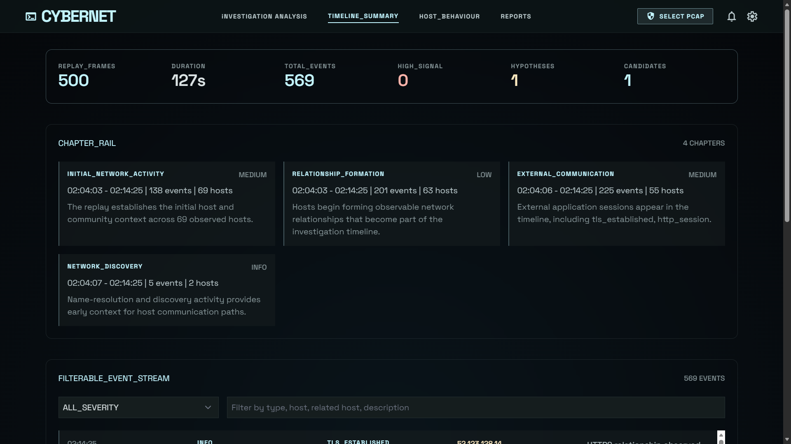
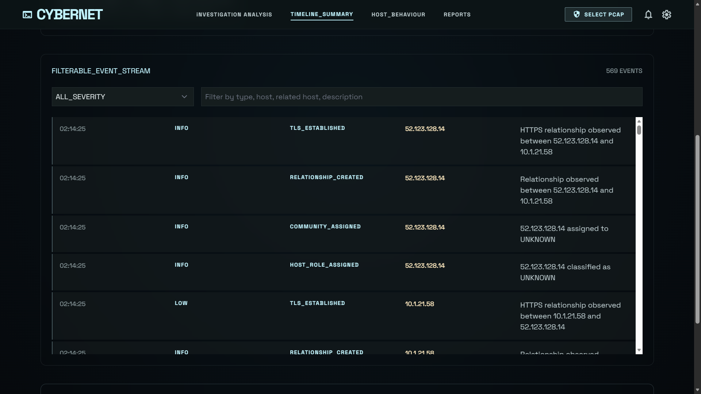
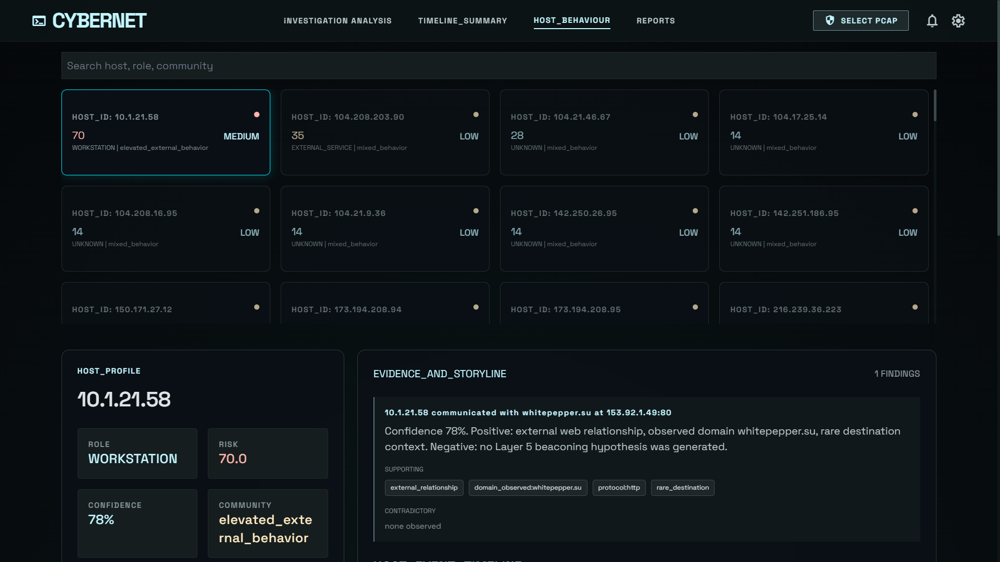
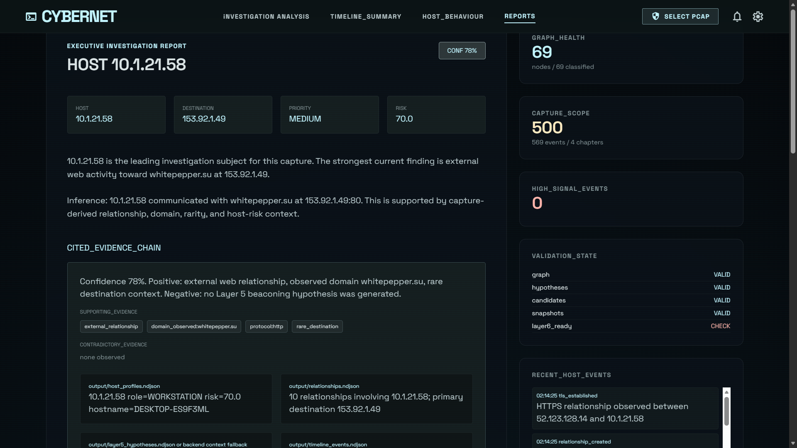
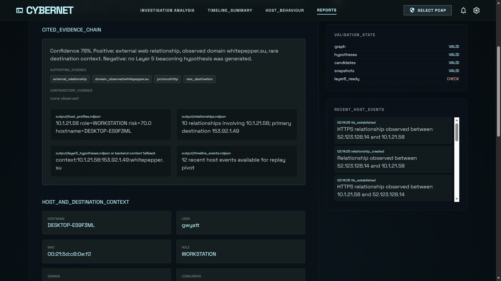
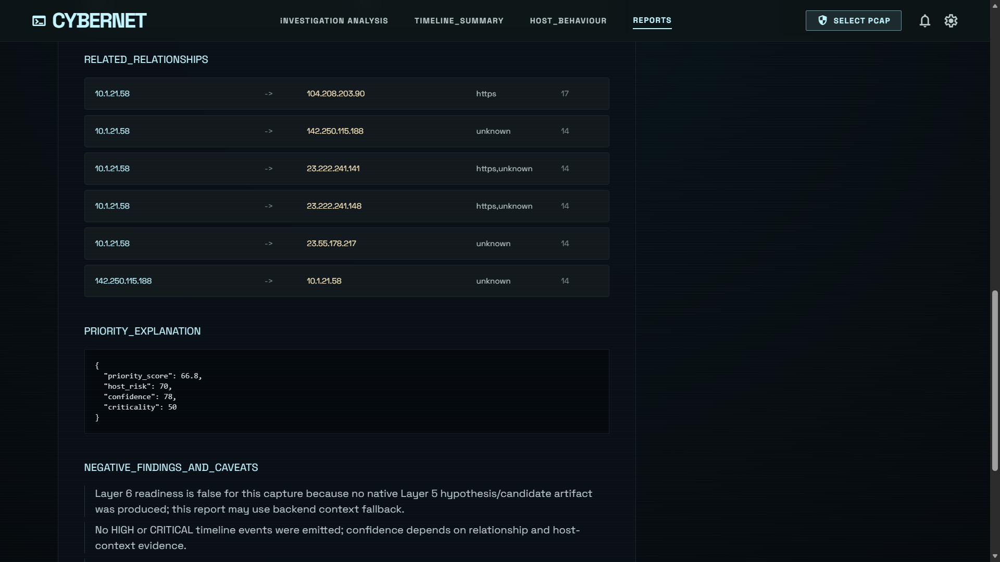
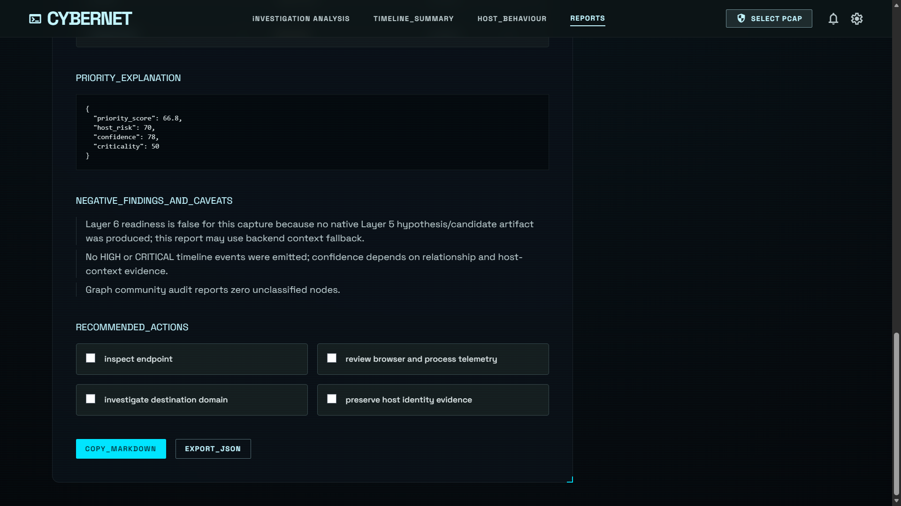

# CyberNet

CyberNet is a PCAP investigation platform that turns packet captures into behavioral findings, host profiles, timelines, narratives, and replayable investigation artifacts.

The project started from a practical investigation question:

> After opening a PCAP, how do you move from packets to an investigation?

Most packet tools are excellent at showing traffic. CyberNet focuses on the next step: progressively transforming raw telemetry into richer investigation context so an analyst can understand which hosts matter, which destinations deserve attention, when behavior emerged, what evidence supports a finding, and what to inspect next.

CyberNet is not a Wireshark replacement. It is a layered analysis and replay system built around behavioral modeling, graph state, evidence explainability, and an analyst-facing frontend.

## What CyberNet Does

CyberNet transforms captures through this pipeline:

```text
PCAP
-> normalized events
-> directional flows
-> behavioral analytics
-> host intelligence
-> relationship graph
-> investigation candidates
-> narratives
-> timeline events
-> replay frames
-> frontend investigation workspace
```

The system can help answer:

- Which hosts deserve attention?
- What behavior is unusual?
- Which destinations are rare or exclusive?
- How did activity evolve over time?
- What evidence supports or contradicts the finding?
- What should an analyst inspect next?
- Can the investigation be replayed visually?

## Screenshots

### Investigation Analysis



The main replay workspace shows the loaded PCAP, replay controls, event stream, chapter timeline, graph state, top host context, and relationship inspection.

### Timeline Summary





The timeline page summarizes replay frames, duration, chapters, event volume, and exposes a filterable event stream for pivoting through the capture.

### Host Behaviour



The host page ranks observed hosts, highlights investigation candidates, and keeps host identity, risk, evidence, destination intelligence, and storyline context together.

### Reports









The report page turns capture-derived context into an analyst handoff with cited evidence, validation state, host and destination context, caveats, recommendations, and copy/export actions.

## Current Status

| Component | Status |
|---|---|
| Packet normalization | Complete |
| Flow intelligence | Complete |
| Behavioral metrics | Complete |
| Host profiling | Complete |
| Relationship modeling | Complete |
| Graph state construction | Complete |
| Temporal snapshots | Complete |
| Layer 5 hypotheses and candidates | Complete |
| Layer 6 narratives | Complete |
| Layer 7 replay artifacts | Complete |
| Layer 8 replay backend | Complete |
| Stitch-derived frontend | Active |

The active app is served by FastAPI and uses static HTML/CSS/JavaScript frontend pages. There is no frontend build step.

## Requirements

- Windows PowerShell
- Python 3.10+
- Wireshark/TShark installed and available on `PATH`
- A local `.pcap`, `.pcapng`, or `.cap` file

Python dependencies are listed in `requirements.txt`.

```powershell
cd C:\Users\siddh\VSCodeFiles\PCAPModels
python -m venv .venv
.\.venv\Scripts\python.exe -m pip install -r requirements.txt
```

Important packages:

- `pyshark` for PCAP parsing through TShark
- `scapy` for packet tooling
- `pandas` for tabular exports
- `pydantic` for data models and DTOs
- `fastapi` and `uvicorn` for the replay backend
- `python-multipart` for browser PCAP uploads

Confirm TShark is visible:

```powershell
tshark --version
```

## Start The App

Start the backend:

```powershell
.\.venv\Scripts\python.exe -m uvicorn layer8_backend.api.app:app --host 127.0.0.1 --port 8000
```

Open:

```text
http://localhost:8000/
```

Click `SELECT PCAP`, choose a capture, and wait for analysis to complete. The backend runs the full pipeline, writes artifacts to `output/`, reloads the artifact provider, and updates all frontend pages.

## Analyze From The CLI

The UI is the preferred workflow, but the analysis pipeline can still be run directly:

```powershell
.\.venv\Scripts\python.exe main.py path\to\capture.pcap --no-csv
```

Artifacts are written to:

```text
output/
```

Use `--no-csv` to skip CSV exports. NDJSON export is enabled by default unless `--no-ndjson` is passed.

## Frontend Pages

| Page | Route | Purpose |
|---|---|---|
| Investigation Analysis | `/` | 3D replay workspace, PCAP selection, playback, seeking, event feed, chapter navigation, node and relationship inspection |
| Timeline Summary | `/frontend/timeline.html` | Capture summary cards, chapter rail, filterable event stream, replay pivots |
| Host Behaviour | `/frontend/hosts.html` | Ranked host list, host profile, identity, evidence, destination intelligence, host events, recommended actions |
| Reports | `/frontend/reports.html` | Analyst handoff report with findings, citations, caveats, evidence chain, copy/export actions |

The frontend consumes backend DTOs only. It never reads NDJSON artifacts directly.

## Main UI Controls

Top navigation:

- `SELECT PCAP`: opens the file picker and starts backend analysis.
- Notification icon: shows runtime logs, validation state, graph health, and artifact readiness.
- Settings icon: shows replay context, appearance controls, speed preference, PCAP selection, and artifact cleanup.

Replay controls:

- Play and pause replay frames.
- Jump to first or last frame.
- Change playback speed.
- Seek through the timeline.
- Click chapter segments to jump and inspect chapter context.

Graph inspection:

- Click a node to open host inspection.
- Click an edge to open relationship inspection.
- Primary suspicious relationships are highlighted when present in the frame.

## Architecture

CyberNet is organized as a layered pipeline.

### Layer 1: Traffic Normalization

Converts packet captures into canonical packet events with normalized timestamps, addressing, protocol hints, replay sequence IDs, and selected identity fields such as MAC, NBNS hostnames, and Kerberos usernames when available.

### Layer 2: Flow Intelligence

Aggregates normalized events into directional flows, preserving timing, ports, byte counts, packet counts, observed domains, protocol enrichment, and identity context.

### Layer 3: Behavioral Analytics

Scores flow behavior using features such as periodicity, persistence, timing consistency, destination behavior, low-volume communication, and protocol mix.

### Layer 4: Graph Intelligence

Builds host profiles, relationships, graph nodes, graph edges, community classification, role inference, graph consistency audits, and temporal snapshots.

### Layer 5: Investigation Engine

Produces investigation hypotheses and candidates with confidence, severity, evidence, contradictory evidence, destination rarity, destination exclusivity, host risk, and priority scoring.

### Layer 6: Narrative Engine

Builds analyst-facing summaries, evidence explanations, caveats, investigation plans, and recommended actions.

### Layer 7: Temporal Reconstruction

Creates timeline events, activity phases, replay frames, host timelines, and replay indices.

### Layer 7.5: Chapter Engine

Groups timeline activity into major investigation chapters used for replay navigation and narrative structure.

Example chapter types:

1. Initial Network Activity
2. Relationship Formation
3. Persistent Communications
4. External Communication
5. Network Discovery
6. Beaconing Indicators
7. Investigation Priority

### Layer 8: Replay Backend And Frontend

Serves replay frames, timeline events, chapters, host context, relationships, destinations, narratives, candidates, hypotheses, health status, and WebSocket replay commands through a backend API. The frontend renders a tactical analyst workspace from those DTOs.

## Repository Structure

```text
aggregation/          Flow construction and behavioral flow metrics
behavior/             Host profiles, role inference, graph state, relationships
docs/                 Architecture, frontend, and design documentation
frontend/             Static HTML/CSS/JS investigation UI
graph/                Community classification
ingestion/            PCAP parsing and protocol enrichment
layer5/               Hypotheses, deltas, candidates, confidence, exports
layer6/               Narratives, reasoning, plans, recommendations
layer7/               Events, phases, chapters, replay frames
layer8_backend/       FastAPI app, APIs, providers, services, WebSocket
tests/                Unit and stabilization tests
output/               Generated artifacts, ignored by Git
main.py               CLI pipeline entrypoint
stabilization_audit.py Layer 4/5 audit artifact generation
```

## Backend API

Replay API:

| Method | Route | Description |
|---|---|---|
| `POST` | `/api/replay/session` | Create replay session metadata |
| `GET` | `/api/replay/frame/{id}` | Fetch a replay frame |
| `GET` | `/api/replay/seek?time=...` | Fetch nearest frame for a timestamp |
| `GET` | `/api/replay/chapter/{id}` | Jump to a chapter start frame |
| `WS` | `/ws/replay` | WebSocket replay command channel |

PCAP selection:

| Method | Route | Description |
|---|---|---|
| `POST` | `/api/pcap/select` | Upload a PCAP, run analysis, reload replay artifacts |

Context API:

| Method | Route | Description |
|---|---|---|
| `GET` | `/api/summary` | Capture totals, top host, primary destination, validation summary |
| `GET` | `/api/hosts` | Ranked hosts with role, risk, identity, candidate status, and finding count |
| `GET` | `/api/hosts/{ip}` | Host details, events, chapters, role, risk, hostname, MAC, user |
| `GET` | `/api/hypotheses` | Hypotheses with evidence, contradictions, confidence explanations, rarity, exclusivity |
| `GET` | `/api/candidates` | Investigation candidates with priority explanations and actions |
| `GET` | `/api/relationships?host=...` | Relationship context and hypothesis evidence |
| `GET` | `/api/destinations` | Ranked destination intelligence |
| `GET` | `/api/community` | Community distribution and node classification audit |
| `GET` | `/api/artifacts/health` | Stabilization and readiness validation status |
| `GET` | `/api/events` | Timeline events |
| `GET` | `/api/chapters` | Major replay chapters |
| `GET` | `/api/narratives` | Investigation narratives |
| `GET` | `/api/phases` | Activity phases |
| `GET` | `/api/runtime/logs` | Backend log and validation summary for the notification panel |

WebSocket replay actions:

```json
{ "action": "play" }
```

```json
{ "action": "pause" }
```

```json
{ "action": "seek", "frame": 124 }
```

```json
{ "action": "speed", "value": 8 }
```

## Output Artifacts

Generated artifacts live under `output/` and are ignored by Git.

Core artifacts:

- `normalized_packets.ndjson`
- `flows.ndjson`
- `enriched_flows.ndjson`
- `host_profiles.ndjson`
- `relationships.ndjson`
- `graph_nodes.ndjson`
- `graph_edges.ndjson`
- `graph_state.ndjson`
- `graph_snapshots.ndjson`
- `layer5_hypotheses.ndjson`
- `layer5_investigation_candidates.ndjson`
- `investigation_narratives.ndjson`
- `timeline_events.ndjson`
- `activity_phases.ndjson`
- `host_timelines.ndjson`
- `major_chapters.ndjson`
- `chapter_index.json`
- `replay_frames.ndjson`
- `replay_index.json`

Audit and readiness artifacts:

- `community_audit.csv`
- `graph_consistency.json`
- `role_consistency_report.json`
- `hypothesis_validation.json`
- `investigation_candidate_validation.json`
- `snapshot_quality.json`
- `layer6_readiness.json`

Uploaded captures are stored under:

```text
output/uploads/
```

## Example Investigation Output

On a representative sample capture, CyberNet produced:

```text
104 host profiles
201 host relationships
717 timeline events
326 activity phases
499 replay frames
7 investigation chapters
```

Example finding:

```text
Host: 10.2.28.88
Role: WORKSTATION
Finding: Potential beaconing behavior
Destination: 45.131.214.85
Confidence: 92%
```

Another validation case surfaced:

```text
Host: 10.1.21.58
Hostname: DESKTOP-ES9F3ML
MAC: 00:21:5d:c8:0e:f2
User: gwyatt
Primary domain: whitepepper.su
Primary destination: 153.92.1.49
```

## Testing

Run the complete test suite:

```powershell
.\.venv\Scripts\python.exe -m unittest discover tests
```

Run focused Layer 8 backend tests:

```powershell
.\.venv\Scripts\python.exe -m unittest tests.test_layer8_backend
```

Syntax-check frontend scripts embedded in the HTML pages:

```powershell
node -e "const fs=require('fs'); for (const f of ['frontend/index.html','frontend/timeline.html','frontend/hosts.html','frontend/reports.html']) { const h=fs.readFileSync(f,'utf8'); const s=[...h.matchAll(/<script[^>]*>([\s\S]*?)<\/script>/gi)].map(m=>m[1]).join('\n'); new Function(s); console.log(f + ': ok'); }"
```

## Troubleshooting

If PCAP upload fails immediately:

```powershell
.\.venv\Scripts\python.exe -c "import multipart; print('ok')"
```

If PCAP parsing fails:

- Confirm Wireshark/TShark is installed.
- Confirm `tshark` is available on `PATH`.
- Run the CLI path directly with the same capture.

If the frontend appears stale:

- Refresh the page.
- Check `/api/summary`.
- Open the notification panel for validation and runtime logs.
- Select the PCAP again if you intentionally want to replace the active capture.

If port `8000` is already in use:

```powershell
Get-NetTCPConnection -LocalPort 8000 -State Listen
```

Stop the owning process or run Uvicorn on another port.

## Documentation

The markdown set is intentionally small:

- `README.md`: setup, operation, architecture summary, APIs, testing
- `docs/ARCHITECTURE.md`: layer and module reference
- `docs/FRONTEND.md`: frontend behavior and UI integration notes
- `docs/DESIGN.md`: visual design tokens and Stitch-derived design reference

Historical planning notes, committed virtualenv files, old Stitch exports, sample captures, and generated artifacts were removed from source control to keep the repository reviewable.

## License

CyberNet is released under the MIT License. See [LICENSE](LICENSE).

## Project Notes

- Keep generated artifacts under `output/`.
- Keep virtual environments under `.venv/` or another ignored directory.
- Do not commit PCAPs, generated NDJSON/CSV/JSON artifacts, cache folders, or installed packages.
- The frontend is static HTML/CSS/JS by design for now.
- The browser consumes backend DTOs only; raw NDJSON is an internal artifact format.
